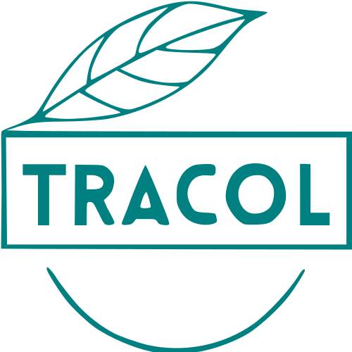

<h1 align="center">
  
  <br/>
  Tracol
</h1>
<p align="center">
  <i>Learning Trash Classification Of Life
    <br/>
    <small>The Project for NUS Summer Workshop 2019</small>
    <br/>Have fun with our demo at <a href="https://tracol.sudotyper.com">tracol.sudotyper.com</a>
  </i>
  <br/>
  We are SW3004 Cluster 3 No.19
  <br/>
  <br/>
  
</p>


## Introduction
**Tracol** is a simple web application, you can upload an image via url, file or using a webcam. The application will return cards, each containing information about the trash in the image. We hope that users can view these cards to learn the types of trash and get better understanding about the environment.

## Demonstration
<p align="center">

</p>

It can also run well in mobile devices

<p align="center">

</p>

## Design
<p align="center">

</p>

The API Server is provided by Baidu AI, which has 500 daily limits (Free Account).

## Structure
```
.
├── apollo-server // The Backend for frontend, use apollo-graphql server
│   ├── datasources
│   ├── live // the database(sqlite3)
│   └── utils
├── public
├── schemas // Graphql schemas
├── src // frontend vue
│   ├── assets
│   ├── components
│   ├── graphql
│   ├── plugins
│   ├── styles
│   ├── types
│   ├── utils
│   └── views
├── tests
│   └── unit
└── utils // Some helper function
```

## Stack
We use Vuejs, Graphql and Apollo to develop our web application.

## Usage in Client
If you want to run the frontend
```
yarn install
yarn serve
```

If you want to build the source in frontend
```
yarn run build
```

You can modify the apollo.config.js to fit your backend server

## Usage in Server
Step in directory [apollo-server](./apollo-server), and install then deps
```
yarn install
```
Then, set your Baidu AI Token as an environment variable
```
export BAIDU_ACCESS_TOKEN="Your Token"
```
You can run the server now

```
node index.js
```

## Dockerfile
If you prefer to use them in docker, you can find the dockerfile in both frontend and backend. We've tested in our own VPS.
The CI is provided by [DaoCloud](https://www.daocloud.io/)

To specify a diffrent port, or enable websocket, you can modify the config in [index.js](./apollo-server/index.js)

## Refer
- [Vue.js](https://vuejs.org/)
- [Graphql](https://graphql.org/)

## Limitations
As I am a newbie in frontend development, there are many places where the code does not conform to the development specification. Most importantly, there is **no test**.
